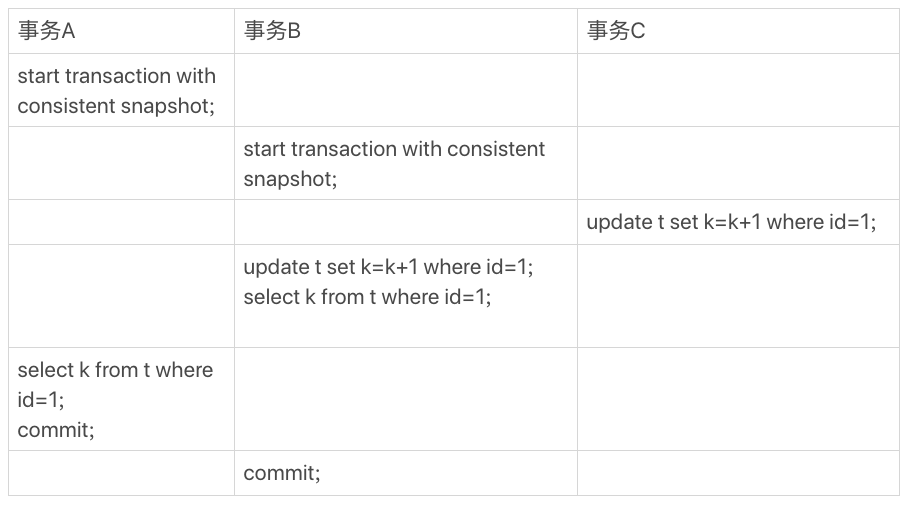

# 基础篇

## 基础架构

MySQL架构图


连接数据库

```shell
mysql -h$ip -P$port -u$user -p
```

链接完成后，输入

```mysql
show processlist;
```

可以查看到已有的连接，第二行是当前的连接，第三行是另一个shell的链接


客户端如果太长时间没动静，连接器就会自动将它断开。这个时间是由参数 wait_timeout 控制的，默认值是 8 小时。

如果在连接被断开之后，客户端再次发送请求的话，就会收到一个错误提醒： Lost connection to MySQL server during query。这时候如果你要继续，就需要重连，然后再执行请求了。

数据库里面，长连接是指连接成功后，如果客户端持续有请求，则一直使用同一个连接。短连接则是指每次执行完很少的几次查询就断开连接，下次查询再重新建立一个。建立连接的过程通常是比较复杂的，所以我建议你在使用中要尽量减少建立连接的动作，也就是尽量使用长连接。

# 日志篇

## 物理日志 redo log 和 WAL(Write-Ahead Logging)

WAL 的全称是 Write-Ahead Logging，它的关键点就是先写日志，再写磁盘。

InnoDB 引擎就会先把记录写到 redo log（粉板）里面，并更新内存，这个时候更新就算完成了。同时，InnoDB 引擎会在适当的时候，将这个操作记录更新到磁盘里面，而这个更新往往是在系统比较空闲的时候做，这就像打烊以后掌柜做的事。

InnoDB 的 redo log 是固定大小的，比如可以配置为一组 4 个文件，每个文件的大小是 1GB，那么这块“粉板”总共就可以记录 4GB 的操作。从头开始写，写到末尾就又回到开头循环写。


write pos 是当前记录的位置，一边写一边后移，写到第 3 号文件末尾后就回到 0 号文件开头。checkpoint 是当前要擦除的位置，也是往后推移并且循环的，擦除记录前要把记录更新到数据文件。(**绿色部分为空着的部分**)

有了 redo log，InnoDB 就可以保证即使数据库发生异常重启，之前提交的记录都不会丢失，这个能力称为 crash-safe。

## 逻辑日志 binlog

最开始 MySQL 里并没有 InnoDB 引擎。MySQL 自带的引擎是 MyISAM，但是 MyISAM 没有 crash-safe 的能力，binlog 日志只能用于归档。而 InnoDB 是另一个公司以插件形式引入 MySQL 的，既然**只依靠 binlog 是没有 crash-safe 能力的**，所以 InnoDB 使用另外一套日志系统——也就是 redo log 来实现 crash-safe 能力。

## redo log 和 binlog 的 区别

- redo log 是 InnoDB 引擎特有的；binlog 是 MySQL 的 Server 层实现的，所有引擎都可以使用。
- redo log 是物理日志，记录的是“在某个数据页上做了什么修改”；binlog 是逻辑日志，记录的是这个语句的原始逻辑，比如“给 ID=2 这一行的 c 字段加 1 ”。
- redo log 是循环写的，空间固定会用完；binlog 是可以追加写入的。“追加写”是指 binlog 文件写到一定大小后会切换到下一个，并不会覆盖以前的日志。

例如：

```mysql
create table T(ID int primary key, c int);
update T set c=c+1 where ID=2;;
```

update语句的执行流程


## redo log 的两段提交

上面的图中，redo log 的写入拆成了两个步骤：prepare 和 commit，这就是"两阶段提交"。

**如何让恢复到半个月内任意一秒的状态：**

- 首先，找到最近的一次全量备份；
- 然后，从备份的时间点开始，将备份的 binlog 依次取出来，重放到中午误删表之前的那个时刻。

**所以为什么要先两段提交？**

比如某列 id 1 改为 2，假设

1. 先写 redo log 后写 binlog，在写完redo log后崩溃，数据库应该中id应该为2，而binlog中没有，恢复时丢了这个更新
2. 先写 binlog 后写 redo log，binlog写完后崩溃，而redo log没写，这个事务无效，而binlog中没有，恢复时多了这个更新

## change buffer

当需要更新一个数据页时，如果数据页在内存中就直接更新，而如果这个数据页**不在内存中**的话，在不影响数据一致性的前提下，InnoDB 会将这些**更新操作缓存在 change buffer 中**，这样就**不需要从磁盘中读入这个数据页**了。

在下次查询需要访问这个数据页的时候，将数据页读入内存，然后执行 change buffer 中与这个页有关的操作。通过这种方式就能保证这个数据逻辑的正确性。

change buffer，实际上它是可以持久化的数据。也就是说，change buffer 在内存中有拷贝，也会被写入到磁盘上。

将 change buffer 中的操作应用到原数据页，得到最新结果的过程称为 merge。除了**访问这个数据页会触发 merge** 外，系统有**后台线程会定期 merge**。在**数据库正常关闭（shutdown）的过程中，也会执行 merge 操作**。

**什么条件下可以使用 change buffer 呢？**

对于唯一索引来说，所有的更新操作都要先判断这个操作是否违反唯一性约束。比如，要插入 (4,400) 这个记录，就要先判断现在表中是否已经存在 k=4 的记录，而这必须要将数据页读入内存才能判断。如果都已经读入到内存了，那直接更新内存会更快，就没必要使用 change buffer 了。

因此，唯一索引的更新就不能使用 change buffer，实际上也只有普通索引可以使用。

将数据从磁盘读入内存涉及随机 IO 的访问，是数据库里面成本最高的操作之一。change buffer 因为减少了随机磁盘访问，所以对更新性能的提升是会很明显的。

# 事务篇

## 事务隔离级别

- 读未提交是指，一个事务还没提交时，它做的变更就能被别的事务看到。
- 读提交是指，一个事务提交之后，它做的变更才会被其他事务看到。
- 可重复读是指，一个事务执行过程中看到的数据，总是跟这个事务在启动时看到的数据是一致的。当然在可重复读隔离级别下，未提交变更对其他事务也是不可见的。
- 串行化，顾名思义是对于同一行记录，“写”会加“写锁”，“读”会加“读锁”。当出现读写锁冲突的时候，后访问的事务必须等前一个事务执行完成，才能继续执行。

查询隔离级别:

```mysql
show variables like 'transaction_isolation'
```


在 information_schema 库的 innodb_trx 这个表中查询长事务，比如下面这个语句，用于查找持续时间超过 60s 的事务

```mysql
select * from information_schema.innodb_trx where TIME_TO_SEC(timediff(now(),trx_started))>60
```

## MVCC

举例：

建表：

```mysql
CREATE TABLE `t` (
  `id` int(11) NOT NULL,
  `k` int(11) DEFAULT NULL,
  PRIMARY KEY (`id`)
) ENGINE=InnoDB;
```

插入数据：

```mysql
insert into t(id, k) values(1,1),(2,2);
```

执行：


三个事务的执行流程：



begin/start transaction 命令并不是一个事务的起点，在执行到它们之后的第一个操作 InnoDB 表的语句，事务才真正启动。如果你想要马上启动一个事务，可以使用 start transaction with consistent snapshot 这个命令。

- 第一种启动方式，一致性视图是在执行第一个快照读语句时创建的；
- 第二种启动方式，一致性视图是在执行 start transaction with consistent snapshot 时创建的。

数据表中的一行记录，其实可能有多个版本 (row)，每个版本有自己的 row trx_id。


图中的三个虚线箭头，就是 **undo log**；而 V1、V2、V3 **并不是物理上真实存在的**，而是每次需要的时候根据当前版本和 undo log 计算出来的。比如，需要 V2 的时候，就是通过 V4 依次执行 U3、U2 算出来。

InnoDB 为每个事务构造了一个数组，用来保存这个事务启动瞬间，当前正在“活跃”的所有事务 ID。“活跃”指的就是，启动了但还没提交。

对于当前事务的启动瞬间来说，一个数据版本的 row trx_id，有以下几种可能：

- 如果落在绿色部分，表示这个版本是已提交的事务或者是当前事务自己生成的，这个数据是可见的；
- 如果落在红色部分，表示这个版本是由将来启动的事务生成的，是肯定不可见的；
- 如果落在黄色部分，那就包括两种情况
  - 若 row trx_id 在数组中(这个事务比当前事务开始的早)，表示这个版本是由还没提交的事务生成的，不可见；
  - 若 row trx_id 不在数组中(这个事务比当前事务开始的晚)，表示这个版本是已经提交了的事务生成的，可见。

## 当前读

**实测在上面实例中语句7之前查询`select * from test1 where id = 1`会得到 1，而执行了语句7之后的查询得到 3，为什么？**

更新数据的时候，就不能再在历史版本上更新了，否则事务 C 的更新就丢失了。因此，事务 B 此时的 set k=k+1 是在（1,2）的基础上进行的操作。

所以，这里就用到了这样一条规则：**更新数据都是先读后写的，而这个读，==只能读当前的值==，称为“当前读”（current read）**。自己的版本号和最新的版本号一致，这个更新才是"自己的"，才能更新。

update触发了当前读，获取到最新版本的(1, 2)，再update得到(1, 3)，而事务A没有触发当前读，所以还是(1, 1)。

**select语句触发当前读**

如果把事务 A 的查询语句 select * from t where id=1 修改一下，加上 lock in share mode 或 for update，也都可以读到最新版本的数据，返回的 k 的值是 3。下面这两个 select 语句，就是分别加了读锁（S 锁，共享锁）和写锁（X 锁，排他锁）。

```mysql
select k from t where id=1 lock in share mode;
select k from t where id=1 for update;
```

实测结果：


执行第9句时卡住了，因为事务B没有提交，事务B提交（第10句）后，事务A的第9句出现了结果。因为事务A的当前读需要id = 1的行锁，而事务B没提交，没有释放这个行锁，事务A就需要等待。

**可重复读的核心就是一致性读（consistent read）**；而事务更新数据的时候，只能用当前读。如果当前的记录的行锁被其他事务占用的话，就需要进入锁等待。

**可重复读和读提交最主要的区别是：**

- 在可重复读隔离级别下，只需要在事务开始的时候创建一致性视图，之后事务里的其他查询都共用这个一致性视图；
  - 个人理解：事务B证明了当前读会更新这个一致性视图
- 在读提交隔离级别下，每一个语句执行前都会重新算出一个新的视图。


# 索引篇

回表和最左前缀不表

## 索引下推

假设有表

```mysql
CREATE TABLE `tuser` (
  `id` int(11) NOT NULL,
  `id_card` varchar(32) DEFAULT NULL,
  `name` varchar(32) DEFAULT NULL,
  `age` int(11) DEFAULT NULL,
  `ismale` tinyint(1) DEFAULT NULL,
  PRIMARY KEY (`id`),
  KEY `id_card` (`id_card`),
  KEY `name_age` (`name`,`age`)
) ENGINE=InnoDB
```

查询

```mysql
mysql> select * from tuser where name like '张%' and age=10 and ismale=1;
```

这个查询可以用到索引 `name_age`，在MySQL5.6之前，只会从第一个命中索引的开始一个个回表，一个个比对 age 和 ismale 字段


而在MySQL5.6之后，会对索引中包含的字段先做判断，直接过滤掉不满足条件的记录，减少回表次数


## 索引的查询过程

先是通过 B+ 树**从树根开始，按层搜索到叶子节点**，然后可以认为**数据页内部通过二分法来定位记录**。

- 对于普通索引来说，查找到满足条件的第一个记录 、后，需要查找下一个记录，直到碰到第一个不满足条件的记录。
- 对于唯一索引来说，由于索引定义了唯一性，查找到第一个满足条件的记录后，就会停止继续检索。

因为引擎是按页读写的，所以说，当找到 k=5 的记录的时候，它所在的数据页就都在内存里了。那么，对于普通索引来说，要多做的那一次“查找和判断下一条记录”的操作，就只需要一次指针寻找和一次计算。

如果这个记录刚好是这个数据页的最后一个记录，那么要取下一个记录，必须读取下一个数据页，这个操作会稍微复杂一些。

但是，对于整型字段，一个数据页可以放近千个 key，因此出现这种情况的概率会很低。

所以普通索引和唯一索引**在查询性能上的差距不大**。

更新时，唯一索引因为要判断是否违反唯一性约束，索引不能使用change buffer，而普通索引可以。

## 选索引

建表

```mysql
CREATE TABLE `test2` (
  `id` int NOT NULL,
  `a` int DEFAULT NULL,
  `b` int DEFAULT NULL,
  PRIMARY KEY (`id`),
  KEY `a` (`a`),
  KEY `b` (`b`)
) ENGINE=InnoDB DEFAULT CHARSET=utf8mb4 COLLATE=utf8mb4_0900_ai_ci
```

使用存储过程生成数据：

```mysql
delimiter ;;
create procedure idata()
begin
  declare i int;
  set i=1;
  while(i<=100000)do
    insert into test2 values(i, i, i);
    set i=i+1;
  end while;
end;;
delimiter ;
call idata();
```

**执行**

```mysql
explain select * from test2 where a between 10000 and 20000;
```

得到


key 字段为 a，表示优化器选择了索引 a。

**再做如下操作**


课程中的到的结果(5.6)是：


实测结果（8.0）是：


因为教程中的索引统计不准确


而实测的索引统计准确


教程中的索引在重新统计后，计算正确


**另一个选错索引的例子**


不管事务A提交没提交都是如此。提交了事务B再运行也是如此


事实的运行速度也是使用force index会更快。

第一种方法就是 force index，很多程序员不喜欢使用 force index，一来这么写不优美，二来如果索引改了名字，这个语句也得改，显得很麻烦。而且如果以后迁移到别的数据库的话，这个语法还可能会不兼容。

第二种方法就是，我们可以考虑修改语句，**引导 MySQL 使用我们期望的索引**。比如，在这个例子里，显然把“order by b limit 1” 改成 “order by b,a limit 1”


第三种方法是，在有些场景下，我们可以新建一个更合适的索引，来提供给优化器做选择，或删掉误用的索引。比如**直接把索引b删掉**。

# 锁

## 全局锁

全局锁就是对整个数据库实例加锁。MySQL 提供了一个加全局读锁的方法，命令是 Flush tables with read lock (FTWRL)。

当你需要让整个库处于只读状态的时候，可以使用这个命令，之后其他线程的以下语句会被阻塞：数据更新语句（数据的增删改）、数据定义语句（包括建表、修改表结构等）和更新类事务的提交语句。

**为什么不用 mysqldump？**

当 mysqldump 使用参数**–single-transaction** 的时候，导数据之前就会启动一个**事务**，来确保拿到一致性视图。而由于 MVCC 的支持，这个过程中数据是可以正常更新的。

有了这个功能，为什么还需要 FTWRL 呢？**一致性读是好，但前提是引擎要支持这个隔离级别**。比如，对于 MyISAM 这种不支持事务的引擎，如果备份过程中有更新，总是只能取到最新的数据，那么就破坏了备份的一致性。这时，我们就需要使用 FTWRL 命令了。

**为什么不使用set global readonly=true 的方式？**

确实 readonly 方式也可以让全库进入只读状态，但我还是会建议你用 FTWRL 方式，主要有两个原因：

- 在有些系统中，readonly 的值会被用来做其他逻辑，比如用来判断一个库是主库还是备库。因此，修改 global 变量的方式影响面更大。
- 在异常处理机制上有差异。如果执行 FTWRL 命令之后由于客户端发生异常断开，那么 MySQL 会自动释放这个全局锁，整个库回到可以正常更新的状态。而将整个库设置为 readonly 之后，如果客户端发生异常，则数据库就会一直保持 readonly 状态，这样会导致整个库长时间处于不可写状态，风险较高。

## 表级锁

MySQL 里面表级别的锁有两种：一种是表锁，一种是元数据锁（meta data lock，MDL)

**表锁的语法是 lock tables … read/write**。与 FTWRL 类似，可以用 unlock tables 主动释放锁，也可以在客户端断开的时候自动释放。

需要注意，lock tables 语法除了会限制别的线程的读写外，也限定了本线程接下来的操作对象。举个例子, 如果在某个线程 A 中执行 lock tables t1 read, t2 write; 这个语句，则其他线程写 t1、读写 t2 的语句都会被阻塞。同时，线程 A 在执行 unlock tables 之前，也只能执行读 t1、读写 t2 的操作。连写 t1 都不允许，自然也不能访问其他表。

**另一类表级的锁是 MDL（metadata lock)**。MDL 不需要显式使用，在访问一个表的时候会被自动加上。MDL 的作用是，保证读写的正确性。你可以想象一下，如果一个查询正在遍历一个表中的数据，而执行期间另一个线程对这个表结构做变更，删了一列，那么查询线程拿到的结果跟表结构对不上，肯定是不行的。

MDL写锁：更改表结构时，加MDL写锁

MDL读锁：增删改查都加MDL读锁


执行顺序是左上，右上，↙，↘。即：


**session C 被 blocked 的原因：**session A 的 MDL 读锁还没有释放，而 session C 需要 MDL 写锁，因此只能被阻塞

**session D 被 blocked 的原因：**新申请 MDL 读锁的请求也会被 session C 阻塞

此时再在session A 和 session B 中输入

```mysql
select * from t limit 1;
```


session B 也会被阻塞，而 session A 不会，也就是除了没有结束事务的 session A，其他 session 全都被阻塞！

事务中的 MDL 锁，在语句执行开始时申请，但是语句结束后并不会马上释放，而会等到整个事务提交后再释放。

如果某个表上的查询语句频繁，而且客户端有重试机制，也就是说超时后会再起一个新 session 再请求的话，这个库的线程很快就会爆满。

session A 提交后，其他 session 取消阻塞。


**如何安全地给小表加字段？**

首先我们要解决长事务，事务不提交，就会一直占着 MDL 锁。在 MySQL 的 information_schema 库的 innodb_trx 表中，你可以查到当前执行中的事务。如果你要做 DDL 变更的表刚好有长事务在执行，要考虑先暂停 DDL，或者 kill 掉这个长事务。

但考虑一下这个场景。如果你要变更的表是一个热点表，虽然数据量不大，但是上面的请求很频繁，而你不得不加个字段，你该怎么做呢？

这时候 kill 可能未必管用，因为新的请求马上就来了。比较理想的机制是，在 alter table 语句里面设定等待时间，如果在这个指定的等待时间里面能够拿到 MDL 写锁最好，拿不到也不要阻塞后面的业务语句，先放弃。之后开发人员或者 DBA 再通过重试命令重复这个过程。

MariaDB 已经合并了 AliSQL 的这个功能，所以这两个开源分支目前都支持 DDL NOWAIT/WAIT n 这个语法。

```mysql
ALTER TABLE tbl_name NOWAIT add column ...
ALTER TABLE tbl_name WAIT N add column ... 
```

MySQL8.0.21亲测无效

## 行锁

在 InnoDB 事务中，行锁是在需要的时候才加上的，但并不是不需要了就立刻释放，而是要等到事务结束时才释放。这个就是**两阶段锁协议**。


行锁死锁


事务 A 在等待事务 B 释放 id=2 的行锁，而事务 B 在等待事务 A 释放 id=1 的行锁。 事务 A 和事务 B 在互相等待对方的资源释放，就是进入了死锁状态。

当出现死锁以后，有两种策略：

- 一种策略是，直接进入等待，直到超时。这个超时时间可以通过参数 innodb_lock_wait_timeout 来设置。
- 另一种策略是，发起死锁检测，发现死锁后，主动回滚死锁链条中的某一个事务，让其他事务得以继续执行。将参数 innodb_deadlock_detect 设置为 on，表示开启这个逻辑。

上图中实测采用了第二种策略，而且 innodb_deadlock_detect 的默认值本身就是 on。

你可以考虑通过将一行改成逻辑上的多行来减少锁冲突。还是以影院账户为例，可以考虑放在多条记录上，比如 10 个记录，影院的账户总额等于这 10 个记录的值的总和。这样每次要给影院账户加金额的时候，随机选其中一条记录来加。这样每次冲突概率变成原来的 1/10，可以减少锁等待个数，也就减少了死锁检测的 CPU 消耗。